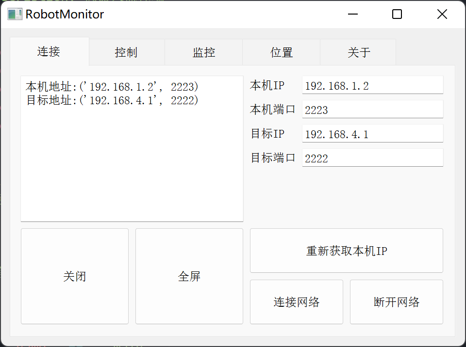

# RobotMonitor



## 运行方法

1. 首先保证你安装了 python3，我使用的版本是python3.8，使用如下命令查看Python版本

```shell
python -v
```

1. 安装 PyQt5、pyqtgraphy、matplotlab、serial、socket、numpy、re、threading等依赖

```shell
pip install -r ./requirements.txt 
```

1. 运行 `robotMonitor.py`

```shell
python3 ./robotMonitor.py
```


## 通信协议：

**一帧数据为：[消息头(2字节)] [命令(2字节)] [长度(1字节)] [数据(n字节，n=长度)] [校验(1字节)] [消息尾(2字节)]**

**消息头固定为[0x55 0xaa]，消息尾固定为[0x0d 0x0a]**

### 主控发给上位机-显示

| 消息作用     | 消息头(2字节) | 命令(2字节) | 长度(1字节) | 数据(n字节，n=长度)        | 校验(1字节) | 消息尾(2字节) |
| ------------ | ------------- | ----------- | ----------- | -------------------------- | ----------- | ------------- |
| 电压、速度   | 55 aa         | 5a 5a       | 10(16)      | 电压、速度、里程计帧数据域 | CRC         | 0d 0a         |
| 里程计       | 55 aa         | 5a 55       | 0c(12)      | 位置x、y、航向角w          | CRC         | 0d 0a         |
| 板载硬件状态 | 55 aa         | 5a aa       | 10(16)       | 基本状态域       | CRC         | 0d 0a         |
| 激光数据     | 55 aa         | 5a a5       | 10(16)      | 激光数据帧数据域           | CRC         | 0d 0a         |


**电压、速度帧数据域：**

| 电压v | 线速度x | 线速度y | 角速度w |
| ----- | ------- | ------- | ------- |
| 4byte | 4byte   | 4byte   | 4byte   |

**里程计帧数据域：**

| 位置x | 位置y | 航向角z |
| ----- | ----- | ------- |
| 4byte | 4byte | 4byte   |

测试： `55 aa 5a 55 0c 3f c9 0c b2 00 00 00 01 00 00 00 01 88 0d 0a`  x1.5707 y ...  z...

**板载硬件状态帧数据域：**

| 底盘电源状态 | 底盘模式 | 红点激光状态 | 底盘速度限制比例 | ...   | ...   | ...   | ...   |
| ------------ | -------- | ------------ | ---------------- | ----- | ----- | ----- | ----- |
| 1byte        | 1byte    | 1byte        | 1byte            | 1byte | 1byte | 1byte | 1byte |

| ..    | ..    | ..    | ..    | ...   | ...   | ...   | ...   |
| ----- | ----- | ----- | ----- | ----- | ----- | ----- | ----- |
| 1byte | 1byte | 1byte | 1byte | 1byte | 1byte | 1byte | 1byte |


**激光数据帧数据域：**

| 激光1 | 激光2 | 激光3 | 激光4 | ...  |
| ----- | ----- | ----- | ----- | ---- |
| 4byte | 4byte | 4byte | 4byte | ...  |

### 上位机发给主控-控制

| 消息作用 | 消息头(2字节) | 命令(2字节) | 长度(字节) | 数据(n字节，n=长度) | 校验(1字节) | 消息尾(2字节) |
| -------- | ------------- | ----------- | ----------- | ------------------- | ----------- | ------------- |
| 速度控制 | 55 aa         | 55 aa       | 14(20)      | 速度控制指令数据域  | CRC         | 0d 0a         |
| 控制按键 | 55 aa         | 55 cc     | 1(1)    | 按键/数值域-00                | CRC | 0d 0a |

**速度控制指令数据域：**

| 线速度x设定 | 线速度y设定 | 角速度w设定 | 航向角设定 |
| ----------- | ----------- | ----------- | ---------- |
| 4byte       | 4byte       | 4byte       | 4byte      |

**速度控制指令数据域：**

| 项目     | 数据 | 取值 |
| -------- | ---- | ---- |
| 红点激光 | 0x01 | 0/1  |
|          |      |      |
|          |      |      |
|          |      |      |
|          |      |      |
|          |      |      |
|          |      |      |


## 更新日志

### updata：2020.8.28

- **Edit：**ylt

- **主要修改内容：**增加通信协议

1. 支持通过串口和wifi发送数据
2. 支持电压、速度、里程计显示
3. 支持板载外设状态显示，激光外设等数据显示
4. 支持发送控制指令控制机器人

### updata：2020.8.18

- **Edit：**ylt

- **主要修改内容：**第一版，未测试wifi

1. 增加串口、wifi支持
2. 增加三次方曲线的路径规划
3. 增加机器人控制、状态监控
4. 增加硬件调试界面
